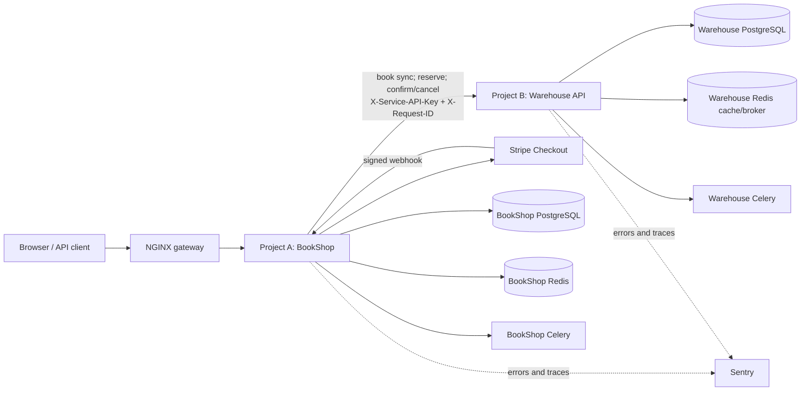

# BookShop + Warehouse Management

[](https://github.com/termopechka/domashka-hillel/actions/workflows/django.yml)

This repository contains two independent Django services:

- **Project A — BookShop** owns users, catalogue presentation, cart, orders,
  Stripe checkout, and payment state.
- **Project B — Warehouse Management** owns the synchronized book identity,
  physical stock, reservations, returns, stock movements, and availability.

Each service has its own PostgreSQL database and Redis instance. Project A
never writes to Project B's database; it communicates through the Warehouse
REST API using a shared service key.

## Architecture



Checkout flow:

1. BookShop creates an order and asks Warehouse to reserve its items.
2. Warehouse locks inventory rows and creates an expiring `PENDING`
   reservation, without reducing physical quantity.
3. BookShop redirects a card order to Stripe.
4. A verified Stripe webhook makes BookShop confirm the reservation.
5. Warehouse decreases both `quantity` and `reserved_quantity` and records a
   `SALE` movement. Failed or cancelled payment releases the reservation.

The operation is safe to retry: BookShop sends an `Idempotency-Key`, and both
reservation creation and state changes are idempotent. `X-Request-ID` connects
the logs of the browser request, Project A, and Project B.

## Technology

- Python 3.12, Django 6, Django REST Framework
- PostgreSQL 15, Redis, Celery, Celery Beat
- Stripe Checkout and signed webhooks
- drf-spectacular Swagger/OpenAPI
- Gunicorn, NGINX, WhiteNoise, Docker Compose
- pytest, pytest-django, pytest-cov (minimum total coverage: 70%)
- optional Sentry error, trace, and Celery monitoring

## Local development startup

Docker is the shortest way to run the complete system. From the repository
root, create local configuration files:

```bash
cp .env.example django_bookshop/.env
cp deploy/warehouse.env.example django_management/.env
```

Change the example passwords and make
`WAREHOUSE_SERVICE_API_KEY` identical in both files. Do not commit either
`.env` file. Start Project A first so that it creates the shared Docker network,
then Project B:

```bash
docker compose -f django_bookshop/docker-compose.yml up --build -d
docker compose -f django_management/docker-compose.yml up --build -d
```

Local addresses:

| Component | URL |
| --- | --- |
| BookShop | <http://localhost/> |
| BookShop Swagger | <http://localhost/api/docs/swagger/> |
| BookShop health | <http://localhost/health/> |
| Warehouse API | <http://localhost:5000/api/v1/> |
| Warehouse Swagger (English) | <http://localhost:5000/en/api/docs/> |
| Warehouse Swagger (Ukrainian) | <http://localhost:5000/uk/api/docs/> |
| Warehouse admin (English) | <http://localhost:5000/en/admin/> |
| Warehouse admin (Ukrainian) | <http://localhost:5000/uk/admin/> |
| Warehouse health | <http://localhost:5000/actuator/health> |

Create administrators when needed:

```bash
docker compose -f django_bookshop/docker-compose.yml exec web python manage.py createsuperuser
docker compose -f django_management/docker-compose.yml exec api python manage.py createsuperuser
```

Stop the applications without deleting database volumes:

```bash
docker compose -f django_management/docker-compose.yml down
docker compose -f django_bookshop/docker-compose.yml down
```

## API bridge and error handling

BookShop configures the client with:

```env
WAREHOUSE_INTEGRATION_ENABLED=True
WAREHOUSE_BASE_URL=http://api:5000/api/v1
WAREHOUSE_SERVICE_API_KEY=replace-with-one-shared-service-key
WAREHOUSE_CONNECT_TIMEOUT=2
WAREHOUSE_READ_TIMEOUT=5
WAREHOUSE_HTTP_RETRIES=2
WAREHOUSE_HTTP_RETRY_BACKOFF=0.25
```

The key is sent only in `X-Service-API-Key` and is never logged. The client
uses separate connection/read timeouts, connection pooling, and exponential
backoff for `429`, `500`, `502`, `503`, and `504`. A Warehouse `4xx` response
becomes `WarehouseRejected`; network and exhausted server failures become
`WarehouseUnavailable`. This lets checkout show a safe message while Stripe
webhooks return retryable `503` only when appropriate.

All API responses include `X-Request-ID`. DRF error bodies also contain
`request_id`, for example:

```json
{
  "code": "INSUFFICIENT_STOCK",
  "message": "Not enough stock for one or more books",
  "details": [],
  "request_id": "39ae76b2-a7db-4075-af9b-72e4a1f46383"
}
```

## Warehouse API

Interactive, localized documentation is generated from code:

- English Swagger: `/en/api/docs/`
- Ukrainian Swagger: `/uk/api/docs/`
- English OpenAPI schema: `/en/api/schema/`
- Ukrainian OpenAPI schema: `/uk/api/schema/`
- ReDoc: `/{language}/api/docs/redoc/`

Business endpoints require either a JWT bearer token or the service key.

| Method | Endpoint | Purpose |
| --- | --- | --- |
| POST | `/api/v1/books/sync/` | Idempotently synchronize a BookShop book |
| GET | `/api/v1/books/` | List synchronized books |
| GET | `/api/v1/books/{bookId}/` | Get a book by external UUID |
| GET | `/api/v1/inventory/{bookId}/` | Get quantity, reserved, and available stock |
| POST | `/api/v1/inventory/check/` | Check one or more requested quantities |
| POST | `/api/v1/inventory/receipts/` | Receive supplier stock |
| POST | `/api/v1/inventory/write-offs/` | Write off damaged/lost stock |
| POST | `/api/v1/inventory/adjustments/` | Apply a counted-stock adjustment |
| POST | `/api/v1/reservations/` | Create an expiring order reservation |
| GET | `/api/v1/reservations/{id}/` | Get a reservation |
| GET | `/api/v1/reservations/?order_id={uuid}` | Find reservations for an order |
| POST | `/api/v1/reservations/{id}/confirm/` | Confirm after successful payment |
| POST | `/api/v1/reservations/{id}/cancel/` | Release after failed/cancelled payment |
| POST | `/api/v1/returns/` | Restock a confirmed-order return |
| GET | `/api/v1/stock-movements/` | Audit stock history; filter by `book_id` and `type` |
| GET | `/actuator/health` | Public health/readiness check |

Example reservation request:

```bash
curl --request POST http://localhost:5000/api/v1/reservations/ \
  --header 'Content-Type: application/json' \
  --header 'X-Service-API-Key: local-key' \
  --header 'Idempotency-Key: ORDER-1001-RESERVE' \
  --data '{
    "order_id": "7a4fbcb0-fdd1-4a84-a7f9-e9b3ae85bd33",
    "items": [{
      "book_id": "7466ef11-b442-4337-a716-9a6c67332dc3",
      "quantity": 2
    }]
  }'
```

## Redis and background jobs

Warehouse caches book details, lists, and inventory snapshots. Model signals
invalidate affected keys after the database transaction commits. Reservation
expiration runs every minute through Warehouse Celery Beat. BookShop uses
separate Redis databases for Celery, catalogue cache, sessions, view cache, and
task results; its Celery worker synchronizes books asynchronously.

## Tests and coverage

All Project B tests live under `django_management/tests/`, matching Project A's
`django_bookshop/tests/` layout. Both pytest configurations produce terminal
and XML reports and fail below 70% total coverage.

Run them in the current development containers:

```bash
docker compose -f django_bookshop/docker-compose.yml exec \
  -e DJANGO_SETTINGS_MODULE=BookShop.test_settings web pytest -q
docker compose -f django_management/docker-compose.yml exec api pytest -q
```

Or install each service's requirements in a Python 3.12 virtual environment and
run `pytest -q` from that service directory. The test settings use SQLite and
local-memory cache, so PostgreSQL and Redis are not required for unit tests.

## CI/CD

`.github/workflows/django.yml` runs on pull requests and pushes that affect
either service. It performs, independently for BookShop and Warehouse:

1. dependency installation and Flake8;
2. pytest with the mandatory 70% coverage gate and XML artifact;
3. missing-migration detection;
4. OpenAPI schema validation;
5. Gunicorn, NGINX, Compose, and Django production deployment checks.

It also validates `compose.production.yml`. A successful push to `main` builds
and publishes immutable BookShop and Warehouse images to GHCR. If the GitHub
repository variable `RENDER_DEPLOY_ENABLED=true` is set, the protected
`production` job deploys the exact image digests using these secrets:

- `RENDER_BOOKSHOP_DEPLOY_HOOK_URL`
- `RENDER_WAREHOUSE_DEPLOY_HOOK_URL`

`render.yaml` defines both web services, their separate PostgreSQL/Redis
resources, and one generated shared service key. Keep both GHCR packages public
for an unauthenticated Render Blueprint pull, or configure registry credentials.

## Production deployment with Docker Compose

For a single Linux host, create real environment files from the templates:

```bash
cp deploy/bookshop.env.example deploy/bookshop.env
cp deploy/warehouse.env.example deploy/warehouse.env
```

Use long independent Django/database/Redis secrets, the same service API key,
real hostnames, HTTPS origins, Stripe keys, and Sentry DSNs. Then run:

```bash
docker compose -f compose.production.yml config --quiet
docker compose -f compose.production.yml up --build -d
```

NGINX exposes BookShop on port `80` and Warehouse on port `8080`. In an actual
internet deployment, terminate TLS at the host/load balancer, map separate
hostnames to the two upstreams, and set `SECURE_SSL_REDIRECT=True`. PostgreSQL
and Redis are not published to the host.

Both Django services run behind NGINX with Gunicorn `gthread` workers. Runtime
parameters such as `WEB_CONCURRENCY`, `GUNICORN_THREADS`, and
`GUNICORN_TIMEOUT` can be changed without rebuilding the images. Project B's
development Compose file intentionally uses `runserver`; its production image
and the root production Compose stack use Gunicorn.

WhiteNoise serves versioned, compressed static assets from both application
containers. The gateway serves BookShop user-uploaded `/media/` files directly
from its read-only volume. Application and gateway health checks prevent NGINX,
Celery workers, and Celery Beat from starting before their dependencies are
ready. Migrations and `collectstatic` run through the web/API entrypoints.

After startup, verify the deployment:

```bash
docker compose -f compose.production.yml ps
curl --fail http://localhost/nginx-health
curl --fail http://localhost/health/
curl --fail http://localhost:8080/actuator/health
```

To deploy CI-built images instead of building locally:

```bash
BOOKSHOP_IMAGE=ghcr.io/owner/repository-bookshop:COMMIT_SHA \
WAREHOUSE_IMAGE=ghcr.io/owner/repository-warehouse:COMMIT_SHA \
docker compose -f compose.production.yml up -d --no-build
```

## Sentry monitoring

Sentry is disabled when `SENTRY_DSN` is empty. Configure a separate Sentry
project/DSN for each Django service:

```env
SENTRY_DSN=https://public-key@sentry.example/project-id
SENTRY_ENVIRONMENT=production
SENTRY_RELEASE=git-commit-sha
SENTRY_TRACES_SAMPLE_RATE=0.1
SENTRY_PROFILES_SAMPLE_RATE=0.0
```

Django and Celery integrations capture unhandled web/task failures and traces.
Expected business conflicts such as insufficient stock remain normal `409`
responses instead of Sentry errors. Default personal-information transmission
is disabled. Search Sentry and application logs with the same `X-Request-ID`
when investigating a cross-service failure.

## Security notes

- Never commit `.env`, production env files, Stripe secrets, Sentry DSNs, or
  service API keys.
- Use different Django, database, and Redis secrets per service.
- Rotate any value that has appeared in source control, chat, screenshots, or
  logs.
- Stripe success redirects do not mark orders as paid; only a verified webhook
  can confirm payment and Warehouse stock.
